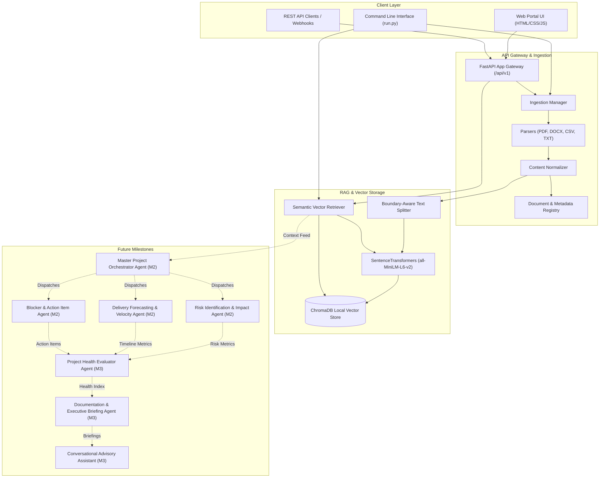
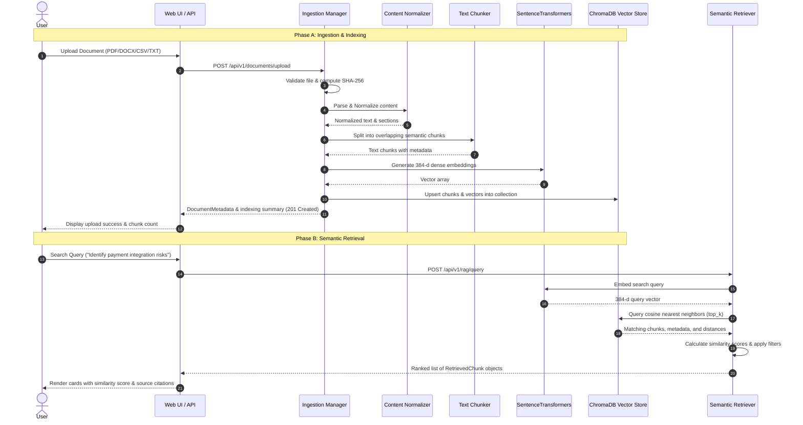

# AI Project Intelligence & Risk Advisor — System Architecture

This document specifies the end-to-end architecture, multi-agent structure, and RAG pipeline for the **AI Project Intelligence & Risk Advisor** system.

---

## 1. High-Level System Architecture

The AI Project Intelligence & Risk Advisor is an agentic, RAG-powered analytics platform designed to continuously analyze software project artifacts (PRDs, sprint sheets, standup notes, Jira/Linear exports, architecture decision records) and generate risk forecasts, blocker resolutions, and executive intelligence.



---

## 2. Milestone 1 Architecture Details

Milestone 1 establishes the foundational layer that powers all subsequent agents:

### 2.1 Document Ingestion Subsystem (`src/ingestion/`)
- **PDF Parser (`PDFParser`)**: Page-by-page text extraction, page number attribution, and document metadata extraction via `pypdf`.
- **DOCX Parser (`DOCXParser`)**: Structured heading, paragraph, and table extraction with column deduplication via `python-docx`.
- **CSV Parser (`CSVParser`)**: Converts tabular sprint/task datasets into structured semantic rows and dataset schemas via `pandas`.
- **TXT Parser (`TXTParser`)**: Robust multi-encoding reader (UTF-8, UTF-16, Latin-1, CP1252) for plain text and markdown documents.
- **Content Normalizer (`ContentNormalizer`)**: Cleans control characters, handles zero-width spaces, rejoins hyphenated wraps, and normalizes consecutive whitespaces while preserving structural breaks.
- **Ingestion Manager (`IngestionManager`)**: Validates files, computes SHA-256 hashes, coordinates parsers, manages batch uploads, and persists metadata in `data/documents_registry.json`.

### 2.2 RAG Pipeline Subsystem (`src/rag/`)
- **Text Chunker (`TextChunker`)**: Recursive boundary-aware text splitter respecting paragraph (`\n\n`), sentence (`. `), and clause boundaries with sliding-window overlap. Preserves rich provenance metadata (`document_id`, `filename`, `file_type`, `chunk_index`, `page_number`, `row_number`, `token_estimate`).
- **Embedding Service (`EmbeddingService`)**: Generates 384-dimensional dense semantic vectors using `sentence-transformers/all-MiniLM-L6-v2` with L2 unit normalization.
- **Vector Store (`ChromaVectorStore`)**: Local persistent vector index in ChromaDB utilizing cosine similarity space.
- **Semantic Retriever (`SemanticRetriever`)**: Natural language query retrieval with cosine similarity scoring, top-k limiting, score thresholding, and metadata filtering (`document_id`, `file_type`).

---

## 3. Multi-Agent Network Structure & Responsibilities

The system is designed with modular agent contracts defined in `src/architecture/system_design.py`.

| Agent Name | Milestone | Core Responsibility | Input Artifacts | Output Artifacts |
| :--- | :---: | :--- | :--- | :--- |
| **Ingestion & Indexer Agent** | **Milestone 1 (Complete)** | Extract, normalize, chunk, embed, and index project documents. | Raw files (PDF/DOCX/CSV/TXT) | Normalized chunks, ChromaDB vectors, doc metadata |
| **Scope & Deliverables Agent** | **Milestone 2 (Complete)** | Extract project goals, boundaries, deliverables, milestones, and owner assignments. | RAG retrieval context, PRDs, specs, sprint sheets | `ScopeExtractionResult` (goals, scope, deliverables, milestones, owners) |
| **Risk Detection & Delivery Forecasting Agent** | **Milestone 2 (Complete)** | Identifies schedule risks, dependency gaps, missing info, technical challenges, and calculates delivery forecast. | RAG retrieval context, risk notes, tickets | `RiskForecastResult` (risk register with severity, delivery forecast, slippage probability) |
| **Blocker & Action Item Agent** | **Milestone 2 (Complete)** | Extracts active blockers, pending decisions, unresolved issues, and action items with assignees and due dates. | Meeting notes, standups, sprint logs | `BlockerActionResult` (blockers, action items, pending decisions, unresolved issues) |
| **Project Health Agent** | Milestone 3 | Computes unified project health scorecard across schedule, quality, and risk. | Risk outputs, forecast data, blocker stats | Overall health index (0-100), dimension breakdown |
| **Docs Generation Agent** | Milestone 3 | Generates executive status summaries, briefing memos, and release notes. | Multi-agent aggregated outputs | Markdown / PDF executive reports |
| **Conversational Advisor** | Milestone 3 | Interactive Q&A chat with project stakeholders using RAG citations. | User prompt, RAG search matches | Streaming cited answers, follow-up advice |

---

## 4. RAG Pipeline Data Flow



---

## 5. Directory Structure & Module Layout

```
AI-project Intelligence/
├── configs/
│   ├── __init__.py
│   └── settings.py               # Global settings & environment variables (Pydantic Settings)
├── data/
│   ├── uploads/                  # Raw uploaded project documents
│   ├── processed/                # Normalized text & section JSON caches
│   ├── vectorstore/              # Persistent ChromaDB vector database files
│   └── documents_registry.json   # Persistent document metadata registry
├── src/
│   ├── __init__.py
│   ├── architecture/             # System design contracts & multi-agent definitions
│   │   ├── __init__.py
│   │   └── system_design.py      # Agent blueprints, state schemas, and contracts
│   ├── ingestion/                # Document Ingestion Subsystem
│   │   ├── __init__.py
│   │   ├── base.py               # Base parser ABC, DocumentMetadata, ParsedDocument
│   │   ├── normalizer.py         # Unicode, whitespace, and formatting normalizer
│   │   ├── manager.py            # IngestionManager for single & batch uploads
│   │   └── parsers/
│   │       ├── __init__.py
│   │       ├── pdf_parser.py     # PDF text & page extraction (pypdf)
│   │       ├── docx_parser.py    # DOCX heading, text & table extraction (python-docx)
│   │       ├── csv_parser.py     # CSV tabular to semantic row converter (pandas)
│   │       └── txt_parser.py     # Multi-encoding text & markdown parser
│   ├── rag/                      # RAG Pipeline Subsystem
│   │   ├── __init__.py
│   │   ├── chunking.py           # Recursive structure-aware text chunker
│   │   ├── embeddings.py         # SentenceTransformers embedding service
│   │   ├── vectorstore.py        # ChromaDB persistent vector database manager
│   │   └── retriever.py          # Semantic retriever with score thresholding
│   ├── api/                      # REST API Subsystem
│   │   ├── __init__.py
│   │   ├── app.py                # FastAPI app creation, CORS & static file mounting
│   │   ├── routes.py             # Ingestion & retrieval endpoint handlers
│   │   └── schemas.py            # Pydantic request/response schemas
│   └── web/                      # Interactive Web Test Dashboard
│       ├── index.html            # Modern HTML portal for uploading & querying
│       └── static/
│           ├── style.css         # Sleek dark-mode aesthetic styling
│           └── app.js            # Frontend JavaScript for upload & search
├── tests/                        # Comprehensive Pytest Suite
│   ├── __init__.py
│   ├── conftest.py               # Test fixtures & synthetic document generators
│   ├── test_ingestion.py         # Tests for PDF, DOCX, CSV, TXT parsers & manager
│   ├── test_chunking.py          # Tests for text chunking & metadata preservation
│   ├── test_embeddings.py        # Tests for dense vector generation
│   ├── test_vectorstore.py       # Tests for ChromaDB indexing & persistence
│   ├── test_retrieval.py         # Tests for semantic query retrieval
│   └── test_api.py               # Tests for FastAPI REST endpoints
├── pyproject.toml                # Project metadata
├── requirements.txt              # Frozen Python dependencies
├── ARCHITECTURE.md               # Complete architectural design guide
├── README.md                     # Quickstart & user documentation
└── run.py                        # CLI entrypoint and server runner
```
